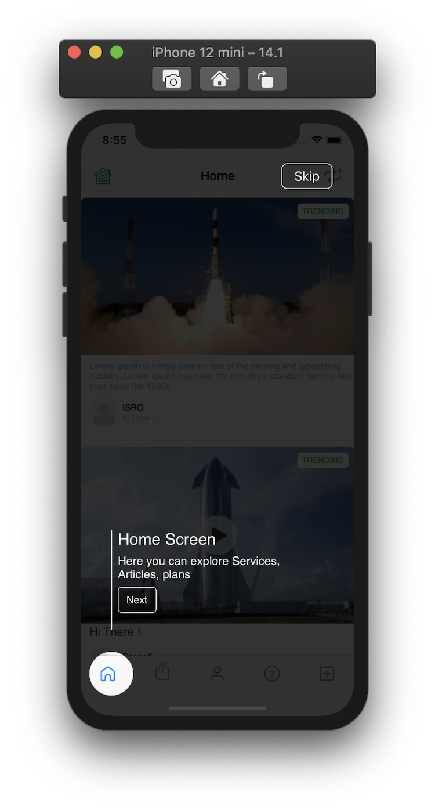
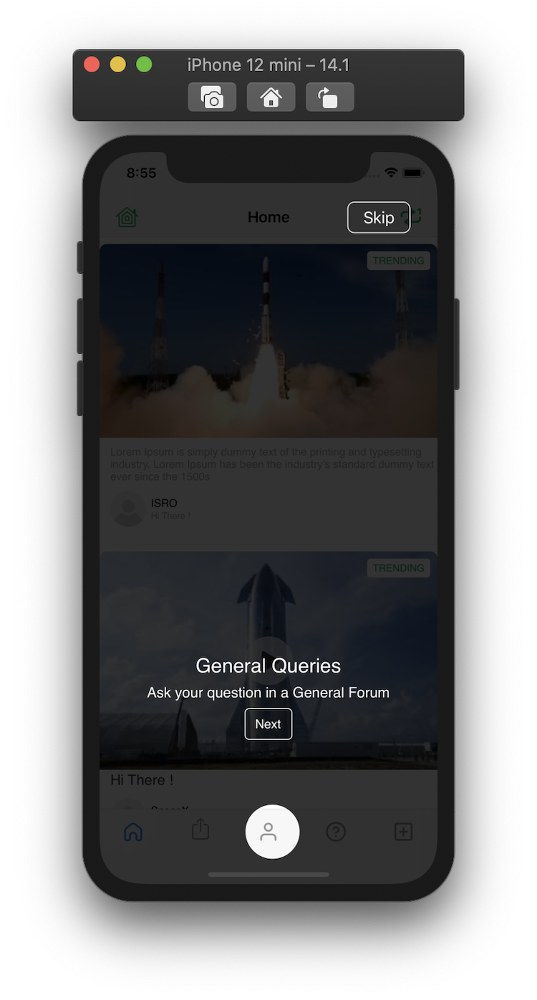
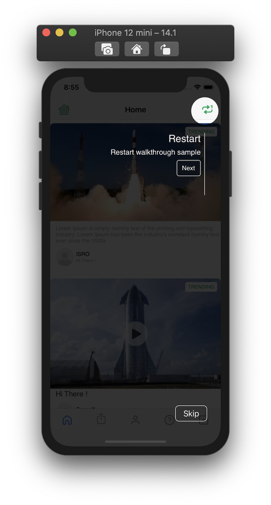

# GLWalkthrough

[](https://travis-ci.org/gokulgovind/GLWalkthrough)
[](https://cocoapods.org/pods/GLWalkthrough)
[](https://cocoapods.org/pods/GLWalkthrough)
[](https://cocoapods.org/pods/GLWalkthrough)

## Example

To run the example project, clone the repo, and run `pod install` from the Example directory first.

## Requirements

## Installation

GLWalkthrough is available through [CocoaPods](https://cocoapods.org). To install
it, simply add the following line to your Podfile:

```ruby
pod 'GLWalkthrough'
```
### Preview
 
 
 

### Public Attribute
|  Attribute name    |  Specific introduction of attributes |
| :------------: | :------------: | 
| `title` | titile to be shown on each object |
| `subtitle` | subtitle to be shown on each object |
| `nextBtnTitle` | button title for next button. (default text is "Next") |
| `isSkipEnabled` | bool to enable/disable skip button (applies to each individual object) |
| `position` | specify the position of object to be highlighted (like bottomLeft, bottomCenter, topRight) |
| `frameOverWindow` | CGRect of object to be highlighted |


### DataSources
|  Attribute name    |  Specific introduction of attributes |
| :------------: | :------------: | 
| `func numberOfItems() -> Int` | gets number of UI object to be highlighted |
| `func configForItemAtIndex(index:Int) -> GLWalkThroughConfig` | Provide detail info of object to be highlighted in form of GLWalkThroughConfig  |


### Delegates
|  Attribute name    |  Specific introduction of attributes |
| :------------: | :------------: | 
| `func didSelectNextAtIndex(index:Int)` | triggered on tap of next button |
| `func didSelectSkip(index:Int)` | triggered when user taps skip  |

### Sample
`Init`
```let coachMarker = GLWalkThrough()
coachMarker.dataSource = self
coachMarker.delegate = self
coachMarker.show()
```
`Datasource`
```
extension ViewController: GLWalkThroughDataSource {
    
    func numberOfItems() -> Int {
        return 1
    }
    
    func configForItemAtIndex(index: Int) -> GLWalkThroughConfig {
        switch index {
        case 0:
            var config = GLWalkThroughConfig()
            config.title = "Home Screen"
            config.subtitle = "Here you can explore Services, Articles, plans"
            config.frameOverWindow = CGRect(x: 50, y: 50, width: 100, height: 100)
            config.position = .topLeft
            return config
        default:
            return GLWalkThroughConfig()
        }
    }
}
```
## Author

gokulgovind, gokulece26@gmail.com

## License

GLWalkthrough is available under the MIT license. See the LICENSE file for more info.
